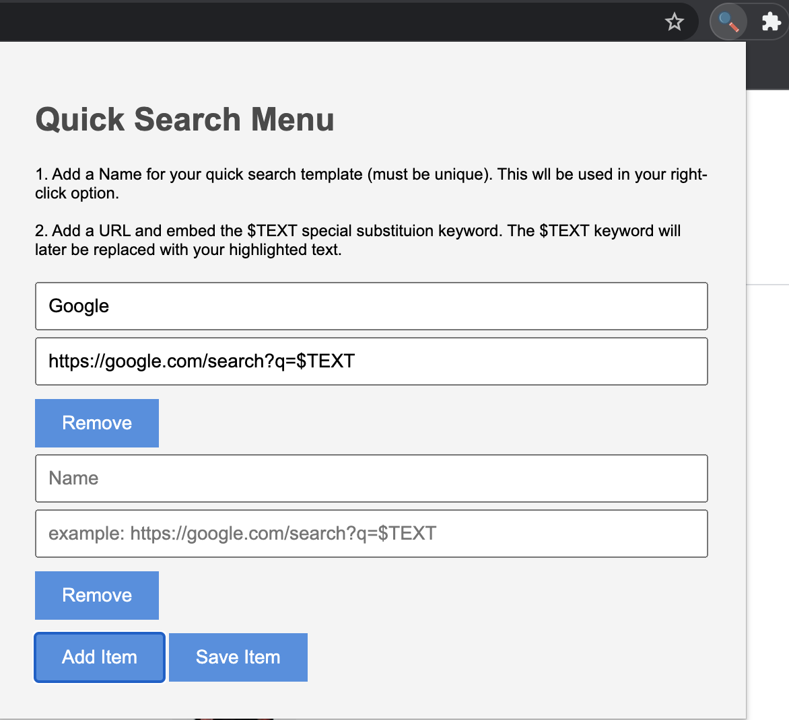

# Quick Search Menu - Chrome Extension

## Summary

Do you highlight, copy and paste into a search bar often? Sure you do!
With a little help from Quick Search Menu you can configure multiple "quick searches" from the extensions options page, which will then become available as right click options.

For example, say I wanted to search Google for the some text I've Highlighted:

After adding the item, we can easily highlight text on the page and search google with our selection:

